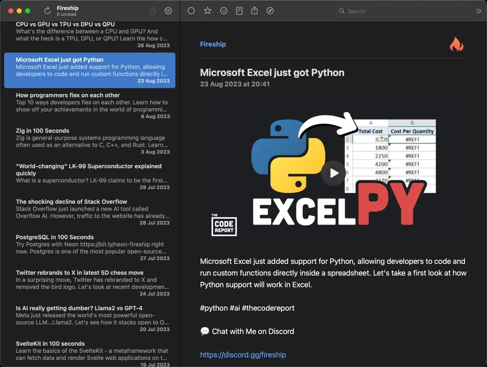

# Simple Youtube RSS Server

While YT technically still has a legacy RSS feed service, it does not actually contain any videos.
This server provides an RSS feed for a given channel. It relies on [yt-dlp](https://github.com/yt-dlp/yt-dlp) for retrieving the actual video instead of just embedding YT player.

## Install Locally ([Apple Silicon](https://support.apple.com/en-us/HT211814))

I have published an apple arm binary on [Homebrew]( https://brew.sh) for running it locally.

```bash
# Make sure the package manager is up to date
brew update

# Install the server
brew tap levitatingpineapple/formulae
brew install yt-rss

# Start the service
brew tap homebrew/services
brew services start yt-rss

# Check that the service has been started
brew services list

# Optional: Install RSS reader
brew install netnewswire
```


## Usage

The server runs on port `7777`
You can subscribe using the handle of the channel in your favourite RSS reader.
For apple platforms I can recommend [Net News Wire](https://netnewswire.com)
```
http://localhost:7777/@Fireship
```

